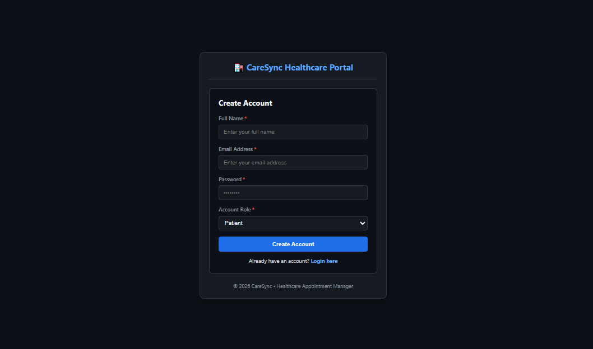
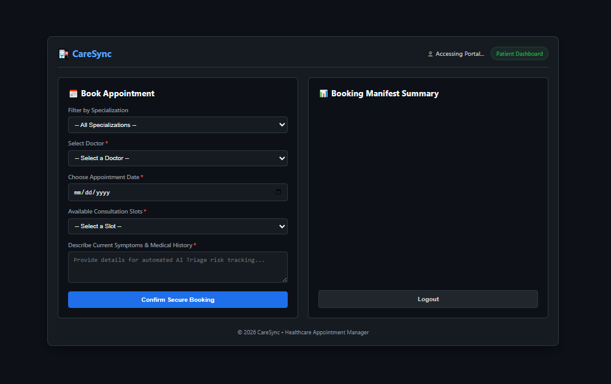
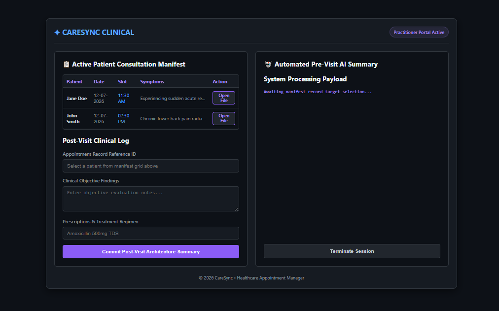
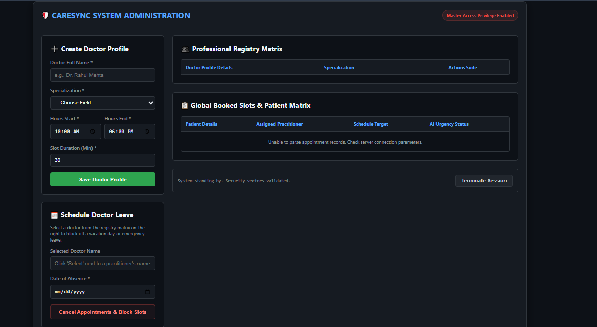

# 🏥 Healthcare Appointment & Follow-up Manager (CareSync)

A full-stack healthcare appointment management system built using **Node.js, Express, MongoDB, and Gemini AI**, supporting Patient, Doctor, and Admin roles with automated scheduling, AI summaries, email notifications, and calendar integration.

---

## 📌 Project Overview

CareSync helps digitize clinic operations by enabling:
- Patients to book appointments and receive AI-generated symptom analysis
- Doctors to manage consultations and view structured patient summaries
- Admins to manage doctors, schedules, and leave management

It also integrates:
- AI-powered medical assistance (Gemini API)
- Google Calendar synchronization
- Email notification system
- Background worker for reminders

---

## 🚀 Features

### 👤 Patient Features
- Register/Login system (JWT-based)
- Search doctors by specialization
- Book appointments with available slots
- AI-generated symptom analysis before confirmation
- View appointment history
- Receive email notifications and reminders

---

### 🩺 Doctor Features
- Secure login
- View today's appointments
- Access AI-generated pre-visit summaries
- Add clinical notes & prescriptions
- Generate patient-friendly post-visit summaries

---

### 🛠️ Admin Features
- Add / Edit / Delete doctors
- Manage doctor specialization & working hours
- Configure slot duration
- Mark doctor leave days
- View all appointments

---

## 🧠 AI Integration (Gemini)

### Pre-Visit Analysis
- Urgency Level (Low / Medium / High)
- Chief Complaint
- Suggested questions for doctor

### Post-Visit Summary
- Converts medical notes into patient-friendly language
- Provides medication & follow-up guidance

---

## 📧 Notification System

- Appointment confirmation emails
- Cancellation emails
- Reminder emails
- Retry mechanism for failed emails

---

## ⏰ Background Worker
Runs every 60 seconds to:
- Retry failed emails
- Send appointment reminders
- Check upcoming schedules

---

## 📅 Google Calendar Integration
- OAuth2 authentication
- Automatic event creation on booking
- Sync between appointments and calendar

---

## 🏗️ System Architecture

Client → Express Server → Middleware → Routes → Controllers → MongoDB / AI / External APIs

---

## 📁 Folder Structure

backend/
├── config/
├── controllers/
├── middleware/
├── models/
├── routes/
├── services/
├── utils/
├── public/
├── server.js
└── app.js

---

## 🗄️ Database Schema

### User
- name
- email
- password (hashed)
- role (patient / doctor / admin)

### Doctor
- specialization
- workingHours
- slotDuration
- leaveDays

### Appointment
- patient
- doctor
- date
- timeSlot
- symptoms
- aiPreVisitSummary
- clinicalNotes
- prescription
- aiPostVisitSummary
- status

---

## 🔐 Authentication
- JWT-based authentication
- bcrypt password hashing
- Role-based access control (RBAC)

---

## 📡 API Endpoints

### Auth
- POST /api/auth/register
- POST /api/auth/login

### Appointments
- POST /api/appointments/book
- POST /api/appointments/post-visit

### Doctors
- GET /api/doctors
- POST /api/doctors/profile
- POST /api/doctors/:id/leave

---

## ⚙️ Installation

```bash
git clone <repo-url>
cd backend
npm install
npm run dev
```

---

## ⚙️ Environment Variables

Create a `.env` file:

PORT=5000  
MONGO_URI=...  
JWT_SECRET=...  

---

## 🧪 Testing
```bash
npm test
```

---

## 📸 Screenshots

### Landing Page


### Patient Dashboard


### Doctor Dashboard


### Admin Dashboard


---

## 👨‍💻 Author
Full-stack healthcare management system project with AI + scheduling automation.

